# JOBSHEET 3

## **Mochammad Zakaro Al Fajri/19/2F** ##

### Jabarkan apa itu Eloquent ORM dan Hubungannya dengan file Model di laravel ###

    Jawab : Eloquent ORM adalah Jenis ORM atau object relational maaping yang mempermudah developer dalam malakukan interaksi dengan database menggunakan object dan method di laravel. Hubungan antara Eloquent ORM dengan File model adalah file model merupakan tempat diaman model dari Elequent didefinisikan sehingga mempermudah dalam melakukan pengatusan dan pengaksesan data dalam databasedengan sintaks yang lebih mudah dipahami.

## Praktikum 1 - $fillable

1.  Simpan kode program Langkah 4 dan 5. Kemudian jalankan pada browser dan amati
apa yang terjadi

    Jawab : Dalam langkah sebelumnya, dilakukan pembuatan $fillable yang mendefinisikan kolom kolom yang dapat diisi oleh user. Kemudian melakukan pembuatan function untuk membuat data yang diisikan ke kolom yag terdapat pada $fillable.
    
    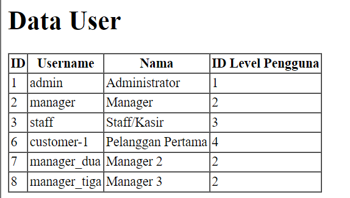

## Praktikum 2.1 – Retrieving Single Models

1. Simpan kode program Langkah 1 dan 2. Kemudian jalankan link
http://localhost:8000/user pada browser dan amati apa yang terjadi dan beri penjelasan
dalam laporan

    Jawab : Pada langkah sebelumnya menggunakan method find() untuk menampilkan data yang ingin dengan variable tertentu yaitu user_id. Kemudian ditampilkan dalam web malalui view  user.blade.php

    

2. Simpan kode program Langkah 4. Kemudian jalankan link http://localhost:8000/user
pada browser dan amati apa yang terjadi dan beri penjelasan dalam laporan

    Jawab : Pada langkah sebelumnya menggunakan method where() dan firstWhere()  untuk mencari baris yang yang sesuai dengan kriteria. Perbedaan anatar kedua method tersebut adalah where() akan menampilkan semua baris yang memenuhi kriteria, sedangkan firstWhere hanya menampilkan baris pertama yang sesuai dengan kriteria. Kemudian ditampilkan dalam web malalui view  user.blade.php

    

3. Simpan kode program Langkah 8. Kemudian jalankan link http://localhost:8000/user
pada browser dan amati apa yang terjadi dan beri penjelasan dalam laporan

    Jawab : Langkah ini menggunakan metod finOr() yang digunakan untuk mencari baris yang sesuai dengan kriteria yang bisa diatur dengan lebih spesifik, dan apabila baris yang sesuai kriteria tidak ditemukan maka output yang didapat akan sesuai dengan nilai default yang diberikan.
    

4. Simpan kode program Langkah 10. Kemudian jalankan link http://localhost:8000/user
pada browser dan amati apa yang terjadi dan beri penjelasan dalam laporan

    Jawab : Disini merupakan contoh apabila tidak ada baris yang memnuhi kriteria dari findOR(), nantinya akan ditampilkan nilai default yang sudah diatur. Pada langkah ini menggunakan Fungsi abort(404) untuk menghasilkan kode status 404 (Not Found)

    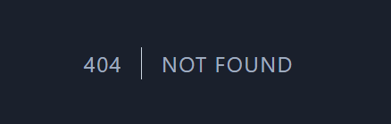

## Praktikum 2.2 – Not Found Exceptions ###
1. Simpan kode program Langkah 1. Kemudian jalankan pada browser dan amati apa yang
terjadi dan beri penjelasan dalam laporan
    
    Jawab : Dalam langkah ini menggunakan method findOrFail()  untuk mencari model berdasarkan primary key yang diberikan. Apabila model yang sesuai tidak ditemukan akan melemparkan pengecualian ModelNotFoundException

    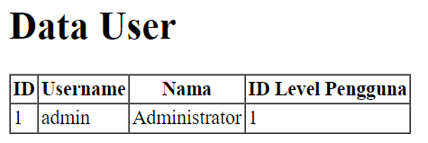

2. Simpan kode program Langkah 3. Kemudian jalankan pada browser dan amati apa yang
terjadi dan beri penjelasan dalam laporan

    Jawab : Langkah ini menggunakan method where() untuk mencari baris yang sesuai dengan kriteria dengan tambahan method firstOrFail() yang hampir sama dengan method first(), tetaoi apabila hasil yang sesuai kriteria tidak ditemukan akan menampilkan output error seperti dibawah

    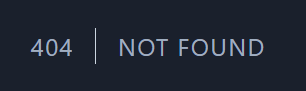

## Praktikum 2.3 – Retreiving Aggregrates

1. Simpan kode program Langkah 1. Kemudian jalankan pada browser dan amati apa yang
terjadi dan beri penjelasan dalam laporan

    Jawab : Dalam langkah ini menggunakan method where untuk melakukan pencarian dan menentukan kriteria yang diingikan kemudian menggunakan method count untuk menghitung jumlah baris / model yang sesuai dengan kriteria. Dalam contoh ini, terdapat 3 baris/data/model yang memiliki nilai Level_id = 2

    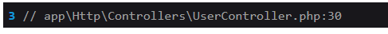

2. Buat agar jumlah script pada langkah 1 bisa tampil pada halaman browser, sebagai
contoh bisa lihat gambar di bawah ini dan ubah script pada file view supaya bisa muncul
datanya

    Jawab : 

        UserController: 
        public function index()
        {
            $userCount = UserModel::where ('level_id', 2)->count();
            return view('user', ['userCount' => $userCount]);
        }

        user.blade.php : 
        <!DOCTYPE html>
        <html lang="en">
        <head>
            <meta charset="UTF-8">
            <meta name="viewport" content="width=device-width, initial-scale=1.0">
            <title>User Data</title>
        </head>
        <body>
            <h1>User Data</h1>
            
            <table border="1">
                <thead>
                    <tr>
                        <th>Jumlah Pengguna</th>
                    </tr>
                </thead>
                <tbody>
                    <tr>
                        <td>{{ $userCount }}</td>
                    </tr>
                </tbody>
            </table>
        </body>
        </html>

    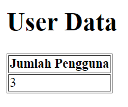

## Praktikum 2.4 – Retreiving or Creating Models
1. Simpan kode program Langkah 1 dan 2. Kemudian jalankan pada browser dan amati
apa yang terjadi dan beri penjelasan dalam laporan

    Jawab : Menggunakan method firstOrCreate() untuk mencari data yang sesuai dengan kriteria, dan apabila tidak ditemukan maka akan dibuat data yang sesuai dengan kriteria yang ditentukan. Kemudian ditampilkan memlalui view user.blade

    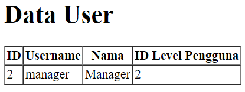

2. Simpan kode program Langkah 4. Kemudian jalankan pada browser dan amati apa yang
terjadi dan cek juga pada phpMyAdmin pada tabel m_user serta beri penjelasan dalam
laporan

    Jawab : pada langkah ini masih menggunakan method firstOrCretae dengan kriteria yang belum ada pada database sehigga pada tabel m_user terdapat data baru yang sesuai dengan kriteria yang sudah ditentukan.

    

    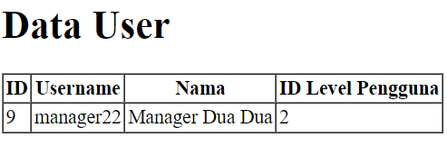

3. Simpan kode program Langkah 6. Kemudian jalankan pada browser dan amati apa yang
terjadi dan beri penjelasan dalam laporan

    Jawab : Dalam langkah ini menggunakan method firstOrNew() yang digunakan untuk mencari data yang sesuai dengan kriteria. apabila tidak ada yang sesuai, maka akan ditambahkan data sementara yang sesuai dengan kriteria tetapi tidak disimpan dalam database 

    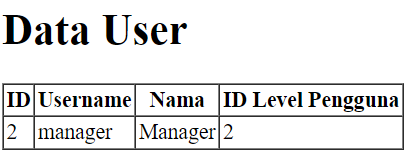

4. Simpan kode program Langkah 8. Kemudian jalankan pada browser dan amati apa yang
terjadi dan cek juga pada phpMyAdmin pada tabel m_user serta beri penjelasan dalam
laporan

    Jawab : Dalam langkah ini masih menggunakan method firstOrNew() dengan kriteria yang tidak sesuai dengan data manapun. Nantinya akan didapt data baru tetapi tidak akan disimpan.

    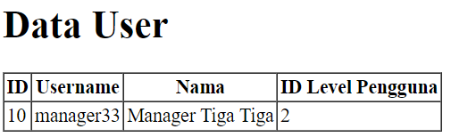

    

5. Simpan kode program Langkah 9. Kemudian jalankan pada browser dan amati apa yang
terjadi dan cek juga pada phpMyAdmin pada tabel m_user serta beri penjelasan dalam
laporan

    Jawab : Dalam langkah ini ditambahkan method save() yang akan menyimpan data sementara tersebut ke database. 
    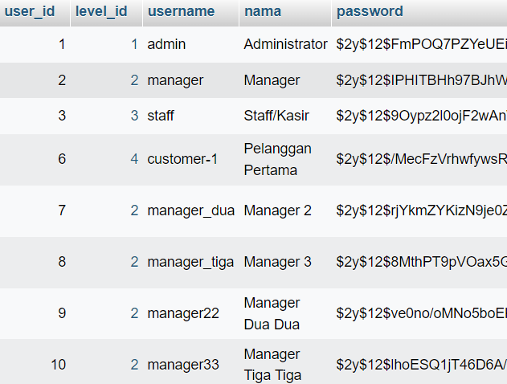

## Praktikum 2.5 – Attribute Changes
1. Simpan kode program Langkah 1. Kemudian jalankan pada browser dan amati apa yang
terjadi dan beri penjelasan dalam laporan

    Jawab : Metode isDirty menentukan apakah ada atribut model yang telah diubah sejak model diambil.  Metode ini isClean akan menentukan apakah suatu atribut tetap tidak berubah sejak model diambil. output yang didapat dari dd($user->isDirty()) akan menunjukkan apakah ada perubahan yang dilakukan pada atribut-atribut model setelah penyimpanan ke dalam database. Jika outputnya true, itu berarti setidaknya satu atribut telah diubah. Jika outputnya false, itu berarti tidak ada atribut yang diubah setelah penyimpanan.

    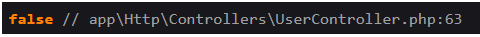 

2. Simpan kode program Langkah 3. Kemudian jalankan pada browser dan amati apa yang
terjadi dan beri penjelasan dalam laporan

    Jawab : Metode ini wasChanged menentukan apakah ada atribut yang diubah saat model terakhir disimpan dalam siklus permintaan saat ini.
    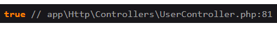

## Praktikum 2.6 – Create, Read, Update, Delete (CRUD)

1. Simpan kode program Langkah 1 dan 2. Kemudian jalankan pada browser dan amati
apa yang terjadi dan beri penjelasan dalam laporan

    Jawab : Melakukan pembuatan tampilan awal CRUD. Kemudian menggunakan method all() untuk mengambil semua data yang ada pada model UserModel

    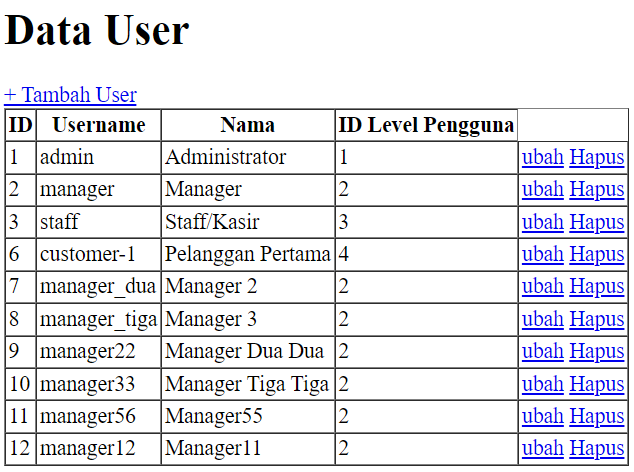

2. Simpan kode program Langkah 4 s/d 6. Kemudian jalankan pada browser dan klik link
“+ Tambah User” amati apa yang terjadi dan beri penjelasan dalam laporan

    Jawab : Melakukan pembuatan fitur tambah data yang digunakan untuk menambahkan data dengan membuat viwe  user_tambah.blade.php untuk tampilan form tambah data, kemudian mengatur routesnya, dan menambahkan fungsi pada controller yang digunakan.
    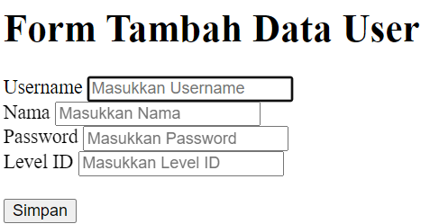

3. Simpan kode program Langkah 8 dan 9. Kemudian jalankan link
localhost:8000/user/tambah atau localhost/PWL_POS/public/user/tambah pada
browser dan input formnya dan simpan, kemudian amati apa yang terjadi dan beri
penjelasan dalam laporan

    Jawab : Dalam langkah ini, dilakukan proses agar data dapat tersimpan. Penggunaan route permintaan POST dikirim ke URL '/user/tambah_simpan', nantinya  metode tambah_simpan() dalam kontroler UserController akan dipanggil. Kemudian menambhakan function yang melakukan prosesan penambahaan data. 

    

4. Simpan kode program Langkah 15 dan 16. Kemudian jalankan link
localhost:8000/user/ubah/1 atau localhost/PWL_POS/public/user/ubah/1 pada
browser dan ubah input formnya dan klik tombol ubah, kemudian amati apa yang terjadi
dan beri penjelasan dalam laporan. 

    Jawab : Menambahkan fitur update yang digunakan untuk merubah data yang sebelumnya telah tersimpan. Dimulai dengan membuat view untuk tampilan form update data, menambhakan route, pembuatan function yang digunakan dalam proses ubah data, kemudian menambahakan function yang menyimpan data yang telah diubah.

    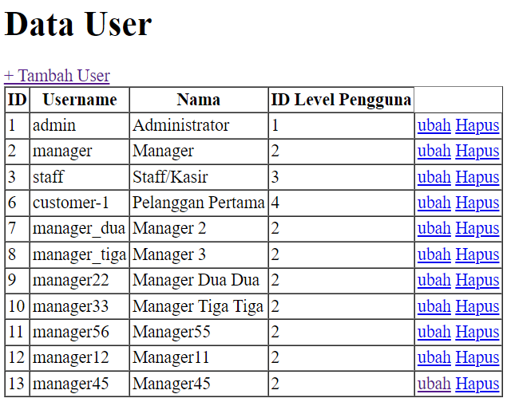

5. Simpan kode program Langkah 18 dan 19. Kemudian jalankan pada browser dan klik
tombol hapus, kemudian amati apa yang terjadi dan beri penjelasan dalam laporan

    Jawab : proses delete menggunakan method find untuk mencari id yang dikirim melalui route kemdian method delete() untuk melakukan penghapusan data.

    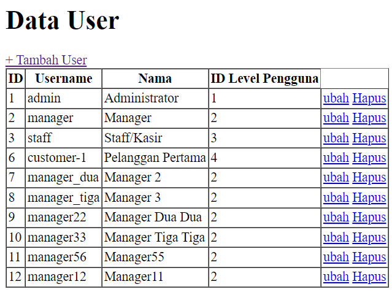

## Praktikum 2.7 – Relationships
1. Simpan kode program Langkah 2. Kemudian jalankan link pada browser, kemudian
amati apa yang terjadi dan beri penjelasan dalam laporan

    Jawab :  Langkah dalam praktikum ini bertujuan  agar pemuatan data pengguna beserta data level dapat dilakukan dalam satu kali panggilan ke database, kemudian menampilkan hasilnya menggunakan dd($user)sehingga pengaksesan data dari model LevelModel untuk setiap pengguna yang diambil dari model UserModel dapat dilakukan dengan mudah 

