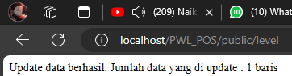
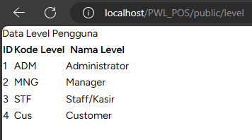
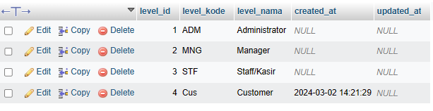
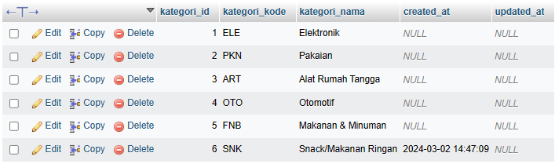
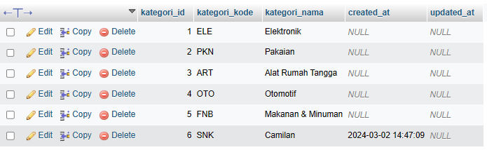
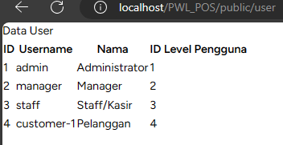
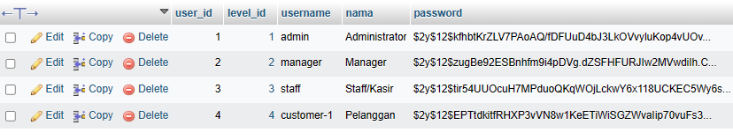
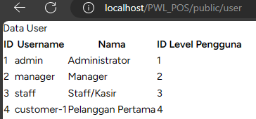
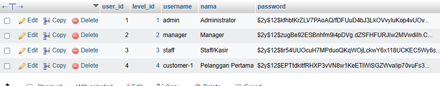

# Laporan Projek PWL_POS
## Praktikum
1. Proses mengupdate data dalam tabel level

2. Proses menambahkan data dalam tabel kategori

3. Proses mengupdate data dalam tabel kategori

4. Proses menambahkan data dalam tabel user

5. Proses mengupdate data dalam tabel user

## Soal

Jawablah pertanyaan berikut sesuai pemahaman materi di atas 

1. Pada Praktikum 1 - Tahap 5, apakah fungsi dari APP_KEY pada file setting .env Laravel? 

> **Jawab**

APP_KEY berfungsi sebagai kunci yang digunakan untuk mengamankan dan mengenkripsi data dalam aplikasi Laravel.

2. Pada Praktikum 1, bagaimana kita men-generate nilai untuk APP_KEY? 

>**Jawab**

Dengan menjalankan perintah "php artisan key:generate" pada terminal.

3. Pada Praktikum 2.1 - Tahap 1, secara default Laravel memiliki berapa file migrasi? dan untuk apa saja file migrasi tersebut? 

>**Jawab**

 "create_users_table.php" Digunakan untuk membuat tabel 

 "create_password_resets_table.php" Digunakan untuk reset kata sandi.

4. Secara default, file migrasi terdapat kode $table->timestamps();, apa tujuan/output dari fungsi tersebut? 

>**Jawab**

Menambahkan kolom created_at dan updated_at yang secara otomatis menyimpan tanggal dan waktu saat record/data dibuat atau diperbarui.

5. Pada File Migrasi, terdapat fungsi $table->id(); Tipe data apa yang dihasilkan dari fungsi tersebut? 

>**Jawab**

Fungsi $table->id() menghasilkan kolom big integer sebagai primary key yang dapat auto-increment.

6. Apa bedanya hasil migrasi pada table m_level, antara menggunakan $table->id(); dengan menggunakan $table->id('level_id'); ? 

>**Jawab**

$table->id('level_id') memberikan nama tabel 'level_id'

$table->id() menggunakan nama default 'id'.

7. Pada migration, Fungsi ->unique() digunakan untuk apa? 

>**Jawab**

Unique() digunakan untuk memastikan nilai pada kolom bersifat unik dan tidak ada duplikasi data.

8. Pada Praktikum 2.2 - Tahap 2, kenapa kolom level_id pada tabel m_user menggunakan $tabel->unsignedBigInteger('level_id'), sedangkan kolom level_id pada tabel m_level menggunakan $tabel->id('level_id') ? 

>**Jawab**

UnsignedBigInteger('level_id') digunakan sebagai foreign key, sementara pada m_level, $table->id('level_id') memberikan nama tabel 'level_id'.

9. Pada Praktikum 3 - Tahap 6, apa tujuan dari Class Hash? dan apa maksud dari kode program Hash::make('1234');? 

>**Jawab**

Hash digunakan untuk hashing dan enkripsi.

10. Pada Praktikum 4 - Tahap 3/5/7, pada query builder terdapat tanda tanya (?), apa kegunaan dari tanda tanya (?) tersebut? 

>**Jawab**

Sebagai tanda untuk menyisipkan nilai parameter ke dalam query SQL. Mencegah SQL injection dan memberikan nilai aman ke dalam query.

11. Pada Praktikum 6 - Tahap 3, apa tujuan penulisan kode protected $table = ‘m_user’; dan protected $primaryKey = ‘user_id’; ?  

>**Jawab**

"protected $table = 'm_user';" dan "protected $primaryKey = 'user_id';" digunakan untuk menghubungkan model dengan tabel dan kunci utama tertentu.

12. Menurut kalian, lebih mudah menggunakan mana dalam melakukan operasi CRUD ke database (DB Façade / Query Builder / Eloquent ORM) ? jelaskan

>**Jawab**

Eloquent ORM, lebih ekspresif dan mudah dipahami, memungkinkan  untuk berinteraksi dengan database menggunakan model dan objek.

----------------------------
Terima Kasih

Muhammad Dayutirta Mahara | TI-2F | 2241720210 | Politeknik Negeri Malang

_______________
